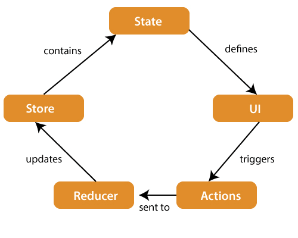

# What is redux in react js?
1. redux is a library of react js
2. redux used for manage state inside of react
3. redux is used for state management
4. redux used for handel a complex structure or projects
5. redux is used to manage state-management library used to manage application state in a centralized store.

# redux life cycle phase
1. State
2. UI
3. Action
4. Reducer
5. Store
6. State

# life cycle aritecture of redux

# Advantage of using redux 
- redux is usedful for when state is shared by many components
- redux provides its toolkit
- redux provides stores where all stored data just like a brain
- redux provides its own stores when redux is install in react js

# how to install redux in react js?
- step 1: check npm or npx
- step 2: check npm -v
- step 3: npm create vite@ latest redux-vite-app
- step 4: npx create-react-app demo-app redux redux-toolkit
- step 5: npm install @reduxjs/toolkit axios react-redux redux-saga react-icons react-bootstrap bootstrap

# redux directory or life cycle flow
1. user interacts with UI
2. components dispatches actions
3. middleware recieves actions
4. reducer processes action
5. stores updates state
6. react redux detects changed state
7. components re-renders